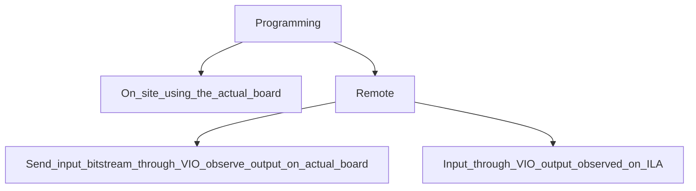

# FPGA-Fabric_Design_and_Architecture
This document is a report of the 5-day intensive workshop on FPGAs, organized by [VLSI System Design](https://www.vlsisystemdesign.com/).<br/>
As a gist, a 4-bit counter and RVMyth processor are taken as the units under test. These are processed on various platforms (Basys3, VTR, and SOFA), and the results obtained on these platforms are compared from timing, power, and area point of view. Day-to-day gist of the workshop is given below:<br/>
- On day-1, a 4-bit counter is designed on Basys3 and the Virtual Input/Output (VIO) strobes of the results are demonstrated.<br/>
- On day-2, Verilog To Route (VTR) flow is explored with the 4-bit counter example and the results (timing, Power, and Area) of VTR and Basys3 are compared.<br/>
- On day-3, the processor code for RVMyth is studied and is run till bitstream on Basys3.<br/>
- On day-4, the timing, Power, and Area results of the 4-bit counter are studied on Skywater OpenSource FPGA (SOFA).<br/>
- On day-5, the RVMyth processor is studied on SOFA and the timing, power, and area results are noted.<br/>

The elaboration of these steps makes this document.<br/>

## Platforms used:
- xyz for doing 123
- pqr to study 234
- mno for analyzing 345
- jkl to 456

## Commands used
  ```
  - cmd1
  - cmd2
  - cmd3
  ```

# Day-wise contents of the workshop
  - Day1
    - <details>
      <summary>Introduction to FPGA</summary>
  
        [click here](#introduction-to-fpga)
      - What is an FPGA?
      - LUTs and ways for programming FPGAs
      - The Basys FPGA boards and Vivado
      </details>
      
    - <details>
      <summary>Vivado_Counter</summary>
    
        [click here](#vivado_counter)
      - Verilog Simulation
      - A bit more on simulation
      - Map pins
      - Slack
      - Synthesis
      - Bitstream constraints
      - Bitstream generation view on Basys3
      - Timing
      - Power_Area
      </details>
    
    - <details>
      <summary>VIO_Counter</summary>
  
        [click here](#vio_counter)
      - Introduction
      - Code
      - Bitstream Outputs
      </details>
      
  - Day2
    - <details>
      <summary>Introduction to OpenFPGA</summary>
  
        [click here](#introduction-to-openfpga)
      - Part-1
      - Part-2
      - VTR flow
      </details>
      
    - <details>
      <summary>VPR</summary>
  
        [click here](#vpr)
      - xml blif
      - tseng GUI
      - Timing report
      </details>
      
    - <details>
      <summary>VTR</summary>
      
        [click here](#vtr)
      - VTR flow with VPR GUI
      - Post synthesis simulation
      - Timing_Area
      - Power Analysis
      </details>
  
    - <details>
      <summary>Earch and Basys3 result comparison</summary>
  
       [click here](#earch-and-basys3-result-comparison)


  - Day3
    - <details>
      <summary>RISC_V core programming using Vivado</summary>
  
        [click here](#risc_v-core-programming-using-vivado)
      - RVMyth Vivado RTL to Synthesis
      - RVMyth Vivado Synthesis to bitstream
      </details>
      
  - Day4
    - <details>
      <summary>Introduction to SOFA FPGA Fabric IP</summary>
  
        [click here](#introduction-to-sofa-fpga-fabric) 
      - Counter Area
      - Counter Timing
      - Counter post impl
      - Counter Power
      </details>
      
  - Day5
    - <details>
      <summary>RISC_V core on custom SOFA fabric</summary>
  
        [click here](#risc_v-core-on-custom-sofa-fabric)
      - SOFA-RVMyth run
      - SOFA-RVMyth timing and area
      - RVMyth post impl netlist
      - SOFA-RVMyth Vivado simulation
      </details>

------------------------------------------------------------------------------------------------------------------------------------
# Introduction to FPGA

After the complete design flow, ASICs are sent to the foundry for fabrication. Once fabrication is done, no change can be made on the IC, especially at the design level. This fact imposes a huge pressure on the reliabilty of the design. It'd be very useful (not just from monetary terms, but from time to market point of view as well)  to have a programmable device that could be used to test multiple design codes (reprogrammable). Research towards this goal yielded devices such as Programmable Logic Arrays (PLAs), Complex Programmable Logic Devices (CPLDs), and Field Programmable Gate Arrays (FPGAs). They basically synthesize a customizable hardware and this hardware could then be used to study the timing, power, and area parameters of the design. **This course uses Basys3 FPGA offered by Xilinx**.

Just like we get the layout as the end product of the whole design procedure of an ASIC, we get a *BITSTREAM* in case of an FPGA. The architecture of an FPGA is explained using the below figure:

  

Since there is a Flip-Flop bank in the CLB, it is capable of storing small data.
  
The below figure explains one of the many ways of implementing an LUT. It shows one of the many ways a code ``` Z = ~(X.Y) ``` could get realised on an FPGA.
  
  
  
The following figure shows a zoom-out view of how the above NAND gate is actually realized. It may be noted that each I/O port can have multiple wires (X, Y, and Z signals are given to wires and connections between these wires (also called interconnets) are made or broken depending on the requirement). 
  
  

Also, interconnections can be made between different CLBs. Let's say, for example, we'd like to implement an expression ``` Z = ~(X.Y) + P ```. A single CLB may be used to realise this logic but alternately, two CLBs might be used too. This is shown in the below figure:
  
  

CLB_1 implements the NAND logic, while CLB_2 implements the OR logic. Closely observing the connections made it may be obvious that the block diagram implemented is:
  ```mermaid
  flowchart LR;
    X --> id1([CLB_1]);
    Y --> id1([CLB_1]);
    id1([CLB_1]) --> id2([CLB_2]);
    P --> id2([CLB_2]);
    id2([CLB_2]) --> Z;
  ```
  
The design flow of FPGA is briefed in the following flow-chart:
  ```mermaid
  flowchart TD;
    Architecture_Description --> RTL_Design_and_TestBench;
    RTL_Design_and_TestBench --> Behavioural_Simulation;
    Behavioural_Simulation --> Synthesis_and_Timing_Analysis;
    Timing_Constraints -->  Synthesis_and_Timing_Analysis;
    Pin_Assignments -->  Synthesis_and_Timing_Analysis;
    Synthesis_and_Timing_Analysis --> Implementating_Place_and_Route;
    Implementating_Place_and_Route --> Bitstream_Generation
  ```

The generated bitstream would be used (either on software or hardware) to get Timing, Power, and Area reports.
  
The following pointers are to considered while writing RTL for FPGAs:
  - Delays should be implemented by designing counters and then keep counting for a few cycles (depending on how much delay is required). #time is not synthesizeable.
  - There is no provison to _initialize_ a variable. The ``` initial ``` block is only for testbenches.
  - User Defined Primitives (UDPs) are non-synthesizeable (obviously!).
  - Indeterminate sizes should be given a fixed size to get synthesized.
  - If the design has loops, it should be made sure that these loops are terminating.


**Some information about Basys3** :  
The following figure (taken from [here](https://digilent.com/reference/basys3/refmanual)) highlights the importamt components on the Basys3 board: 
  
  

 Ironically, the most important component is not highlighted, the FPGA bank. According the [reference manual](https://digilent.com/reference/basys3/refmanual),</br> 
  " _The Basys3 board is a complete, ready-to-use digital circuit development platform based on the latest Artix-7™ Field Programmable Gate Array (FPGA) from Xilinx. With its high-capacity FPGA [XC7A35T-1CPG236C](https://docs.xilinx.com/v/u/en-US/ds181_Artix_7_Data_Sheet), low overall cost, and collection of USB, VGA, and other ports, the Basys3 can host designs ranging from introductory combinational circuits to complex sequential circuits like embedded processors and controllers. It includes enough switches, LEDs and other I/O devices to allow a large number designs to be completed without the need for any additional hardware, and enough uncommitted FPGA I/O pins to allow designs to be expanded using Digilent Pmods or other custom boards and circuits_ ".</br>
  
There are different ways of programming the board:

In remote way of programming, if the IP address of the board is known, we may send the input to the board through Virtual Input/Output (VIO), and observe the output from the board. In cases where the board is not available (like this workshop), the inputs are processed through VIO and the output can be observed on a Integrated Logic Analyser (ILA).

-------------------------------------------------------------------------------------------------------------------------------------------------


